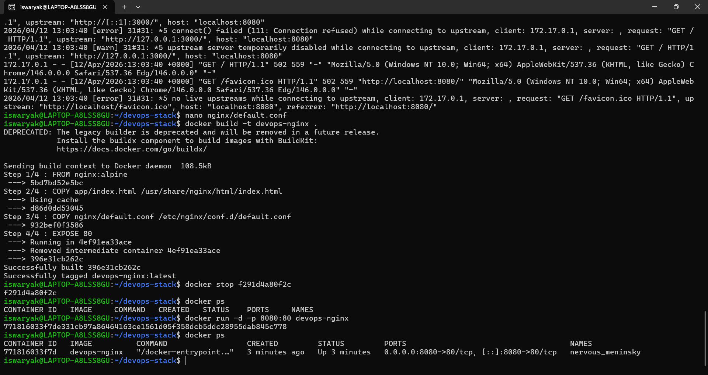

# DevOps Stack Project

## Features
- Terraform-based VM provisioning (GCP-style)
- Ansible automation for server setup
- Nginx reverse proxy configuration
- Database backup script
- Jenkins CI/CD pipeline
- Basic security patch check

## Tools Used
Terraform | Ansible | Nginx | Jenkins | Bash | GCP (concept)

## Outcome
Demonstrates real-world DevOps workflow including:
IaC + Automation + CI/CD + Security
## Live Output

### Application Running

### Docker Container

